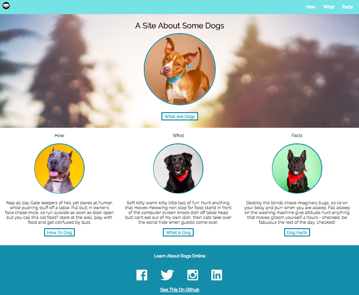

# Dog Party
---
**Project description**: It’s a dog party! The reality is, as a frontend developer, you’re going to be building out a lot of the UI on websites and apps. This can be a lot of fun, and you definitely want to get good at it! One of the beginning pieces is using semantic html and writing clean CSS. Similar to what you might do in a job, you’ve got a comp and need to build it out.

---
##### Comp Photo 

##### My Site 

---
**Reflection**: This project taught me a lot about margins and padding. At first I was overwhelmed with the chaos of things not lining up as they were supposed to, and even after getting it right as a static site, I then found myself frustrated that I couldn't figure out how to make it responsive to different screen sizes. I really look forward to learning CSS grid and being able to use that to make my websites more clean and responsive.